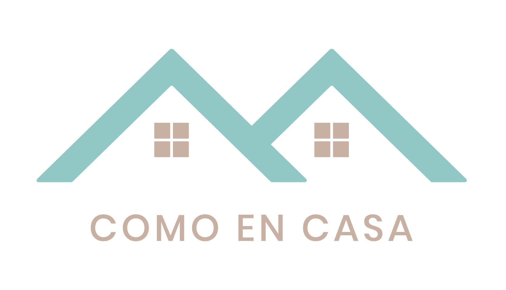

# Certified Tech Dev - Proyecto Integrador / _Final Project_

[COMO EN CASA](http://52.67.178.177/) 

 

## Propósito / _Purpose_ ✒
Desarrollo de sitio web para gestión de reservas de alojamientos (cabañas, casas o departamentos). 

_Website development for managing accommodation reservations (cabins, houses or apartments)._

## Tecnologías y herramientas empleadas / _Technologies and tools used_ 🛠
- Java
- SpringBoot
- Maven
- React Js
- SCSS
- MySQL
- AWS
- Jest
- Postman

## Documentación / _Documentation_ 📑
[API Docs](http://52.67.178.177:8080/swagger-ui.html)

## Equipo / Development team 🧠
- Aurrecoechea, Ignacio [ignacioaurre](https://github.com/ignacioaurre)
- Faccini, Trinidad [trinifaccini](https://github.com/trinifaccini)
- Medina, Sofía [Sofiamedina002](https://github.com/Sofiamedina002)
- Murga, María Luciana [lumurga](https://github.com/lumurga)
- Nolan, Brenda [BrendaNolan](https://github.com/BrendaNolan)

## Presentación / _Presentation_
[DEMO](ComoEnCasa.pdf)
